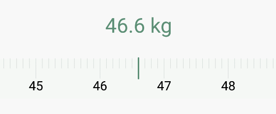

# HenCoderSample

HenCoder 自定义View 示例

## 点赞效果

点赞手势实现

>颜色变更使用 tint 实现,放大缩小,可以使用属性动画,也可以放大缩小  Canvas

点赞数字滚动实现

>使用被动绘制,不断变更绘制的偏移量

[自定义View被动式绘制 \| 学习笔记](http://liujin.tech/2018/03/15/%E8%87%AA%E5%AE%9A%E4%B9%89View%E8%A2%AB%E5%8A%A8%E5%BC%8F%E7%BB%98%E5%88%B6/)

点赞数字按位滚动实现

>在响应滚动时,判断数字截断的位置,只绘制变化的部分

数字触摸变更实现

>触摸时更新距离,根据距离显示数字

数字触摸滑动,响应fling,自动对齐

>根据滑动距离计算需要显示的数字,fling时需要修正最终位置,使其正好停在一个数字对应的位置上,在速度不够 fling 的时候发生scroll,scroll最终也需要停在一个数字对应的位置上

完整点赞效果

>将以上效果组合

## 测量尺效果

该尺子触摸滑动,自动对齐刻度,支持惯性滑动

## 折纸效果

折纸效果,根据按下位置折叠图片